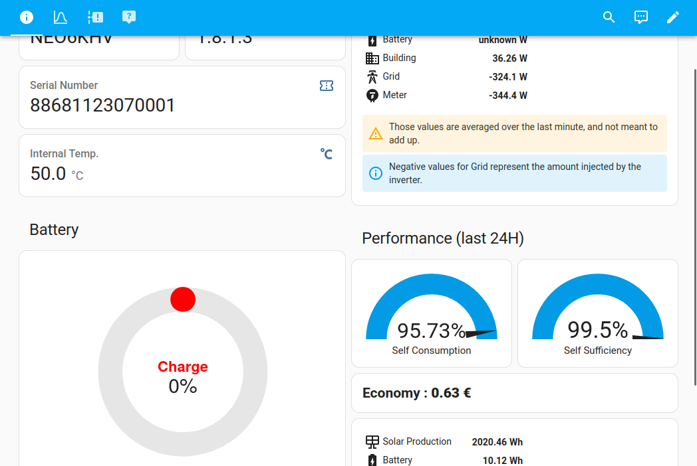

## Imeon Integration Extras

Custom dashboard templates for the custom [Imeon Integration](https://github.com/Imeon-Inverters-for-Home-Assistant/imeon-integration). Uses [APEXCharts-card](https://github.com/RomRider/apexcharts-card/blob/master/README.md#data_generator-option) for graphs and custom gauges.

### Screenshots

### Installation

1. **Access Lovelace Dashboard**: Click on the "Overview" tab on the sidebar to access Lovelace, Home Assistant's dashboard interface.
2. **Edit the Dashboard**: Click on the three-dot menu in the top right corner and select "Edit Dashboard."
3. **Manage Dashboards**: Click on the three-dot menu again and select "Manage Dashboards."
4. **Create a New Dashboard**: Click on "Add Dashboard" to create a new one.
5. **Enable YAML Mode**: When creating the new dashboard, toggle the "YAML Mode" option to enable it.
6. **Paste the template**: Copy and paste the contents of `/dashboard/dashboard.yaml` in the editor.
7. **Replace the keys**: Search and replace `#INVERTER#` with the domain name of your inverter, for example `imeon_84`.

### Troubleshooting

-  **What is my domain name?** The domain name is the internal name given to your inverter by Home Assistant. It's based on the initial name you gave to your device, albeit formatted to avoid internal issues. 
    - A name such as `Imeon Inverter number 57` would give you a domain name of `imeon_inverter_number_57`.
    - If you're still struggling to find the domain name, check the internal name of the entities under the device. The name of each variable is `DOMAIN_variable-name`, for example `neo_110_inverter_software_version` tells us the domain name is `neo_110`.

- **How to install APEXCharts-card ?** [APEXCharts-card's README](https://github.com/RomRider/apexcharts-card/blob/master/README.md#data_generator-option) explains everything needed to install this custom ressource on your installation.

